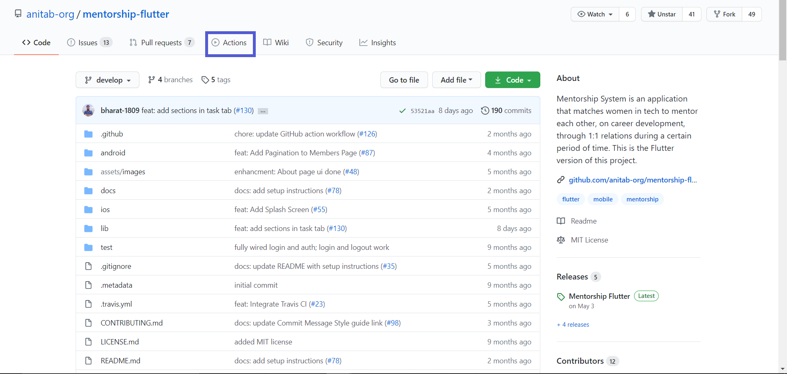
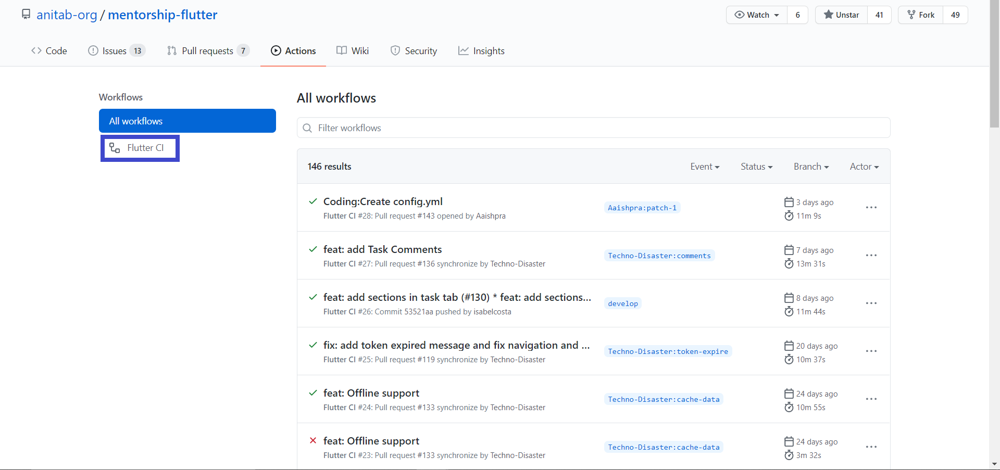
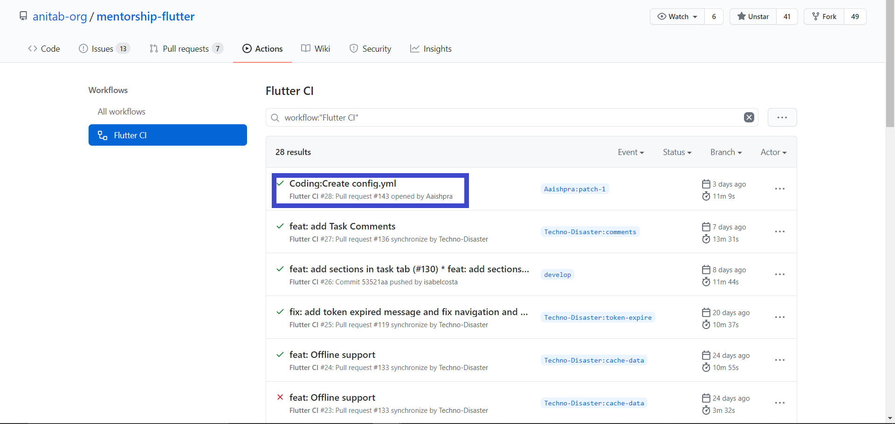
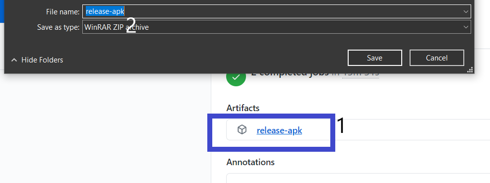
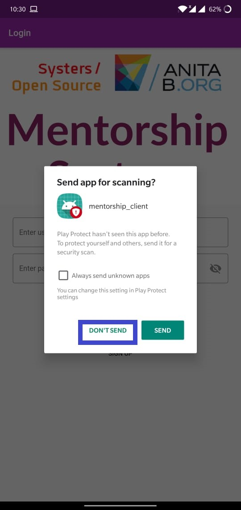
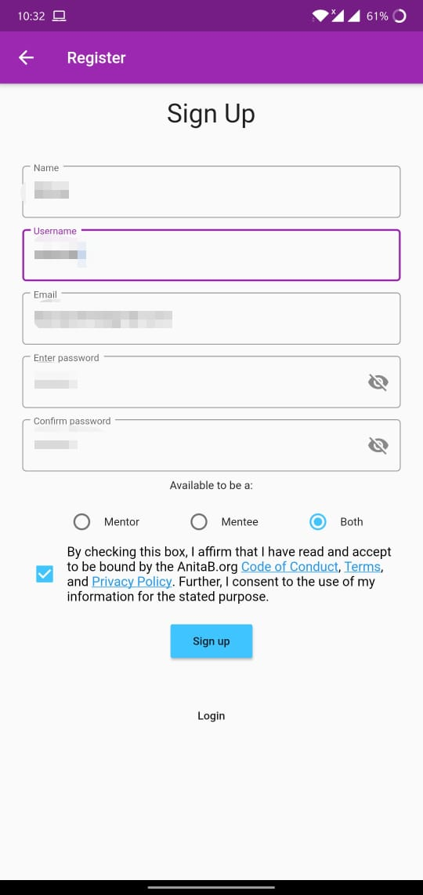
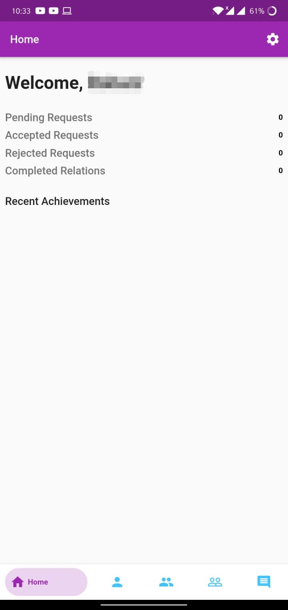

<h1 align="center"> Testing Guide </h1>

This is a testing guide to ease out testing apks, without Android Studio.

**Steps:**

1. Go to [Actions](https://github.com/anitab-org/mentorship-flutter/actions).

2. Click on Flutter CI.

3. Click on any PR that you want to test.

4. Click on Artifacts and then download the Release apk.

5. After downloading the Release apk, unzip the file and then install the app. (Try to install the app using the apk if you have an android device.)

6. CLick on "Don't send".

7. Sign up into the app if you've installed for the first time, and then after activating, log-in.

Confirm with your e-mail ID.

8. You're logged in now. Go and test that particular feature out and there you go!

